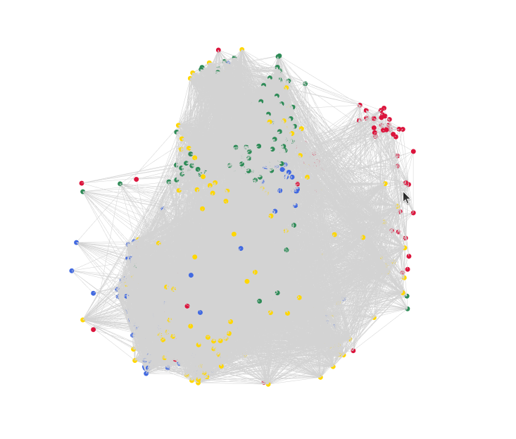

# 🧠 Drosophila Connectome 3D Atlas

Bu proje, yetişkin bir meyve sineğinin (*Drosophila melanogaster*) beyin haritasını (connectome) analiz etmek ve işlevsel beyin bölgelerini 3D uzayda görselleştirmek için geliştirilmiş bir veri bilimi çalışmasıdır.

Janelia Research Campus tarafından sağlanan **hemibrain** veri seti kullanılarak, beynin koku alma (Antennal Lobe), uzamsal yönelim (Ellipsoid Body), hafıza (Mushroom Body) ve görme (Medulla) gibi kritik merkezleri neuPrint API üzerinden çekilmiş ve modellenmiştir.



### 🎨 Renk Lejantı

| Renk | Bölge | İşlev |
|---|---|---|
| 🟡 Sarı | Mushroom Body (MB) | Öğrenme ve hafıza |
| 🔵 Mavi | Ellipsoid Body (EB) | Uzamsal yönelim / navigasyon |
| 🟢 Yeşil | Antennal Lobe (AL) | Koku algısı |
| 🔴 Kırmızı | Medulla (Optic Lobe) | Görme — ilk işleme |
| ⚪ Gri çizgiler | — | Nöronlar arası sinaptik bağlantılar |

## 🚀 Özellikler

* **Neuprint API Entegrasyonu:** Milyonlarca sinaps ve nöron arasından hedeflenen işlevsel bölgelerin dinamik olarak çekilmesi.
* **Büyük Veri Optimizasyonu:** Pandas kullanılarak karmaşık veri setlerinin (nodes & edges) temizlenmesi ve filtrelenmesi.
* **Gerçek Anatomik Konumlandırma:** Nöronlar, soyut bir düzen yerine gerçek 3D soma (hücre gövdesi) koordinatlarına göre yerleştirilir.
* **İnteraktif 3D Görselleştirme:** Plotly kullanılarak, nöron tiplerinin ve işlevlerinin incelenebildiği, bölge bazlı renklendirilmiş 3D grafik (HTML) çıktısı üretimi.

## 🛠️ Kullanılan Teknolojiler

* **Dil:** Python
* **Kütüphaneler:** Pandas, Plotly, NetworkX, Neuprint-python, Python-dotenv
* **Çevre:** Ubuntu, VS Code, Git

## 📦 Kurulum

```bash
git clone https://github.com/hakanEfeTuysuz/fly-connectome-viz.git
cd fly-connectome-viz

python3 -m venv venv
source venv/bin/activate        # Windows: venv\Scripts\activate

pip install -r requirements.txt
```

neuPrint verisine erişmek için ücretsiz bir hesap ve token gerekir:

1. [neuprint.janelia.org](https://neuprint.janelia.org) adresinden Google hesabınızla giriş yapın.
2. Hesap menüsünden **Auth Token**'ınızı kopyalayın.
3. Proje kök dizininde bir `.env` dosyası oluşturup içine ekleyin:

```
NEUPRINT_APPLICATION_CREDENTIALS=token_buraya
```

## ▶️ Çalıştırma

Tek bölge (Ellipsoid Body) için:

```bash
python fetch_data.py
python visualize.py
```

Çoklu bölge — işlevsel beyin atlası için:

```bash
python fetch_atlas.py
python visualize_atlas.py
```

Her ikisi de çalıştırıldıktan sonra tarayıcıda otomatik açılan bir `.html` dosyası üretir; fare ile döndürüp yakınlaştırabilir, nöronların üzerine gelerek tip ve işlev bilgisini görebilirsiniz.

## 📊 Beyin Bölgeleri ve İşlevleri

| Bölge | İşlev |
|---|---|
| Mushroom Body (MB) | Öğrenme ve hafıza |
| Ellipsoid Body (EB) | Uzamsal yönelim / navigasyon |
| Antennal Lobe (AL) | Koku algısı |
| Medulla (Optic Lobe) | Görme — ilk işleme |

## 📚 Veri Kaynağı

Bu projede kullanılan connectome verisi [Janelia Research Campus – FlyEM Hemibrain](https://www.janelia.org/project-team/flyem/hemibrain) projesinden alınmıştır ve **CC-BY** lisansı altında sunulmaktadır.